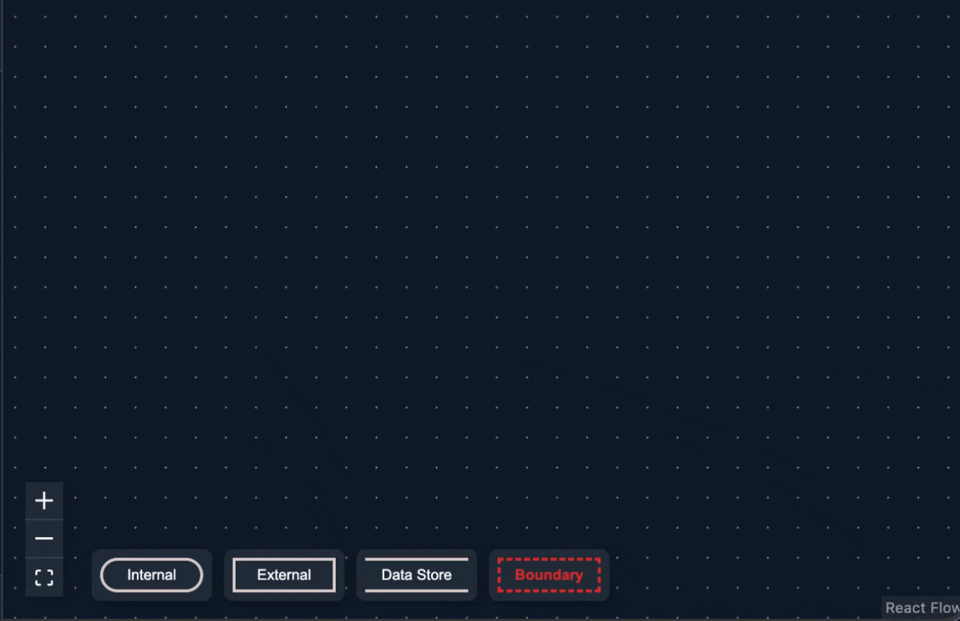
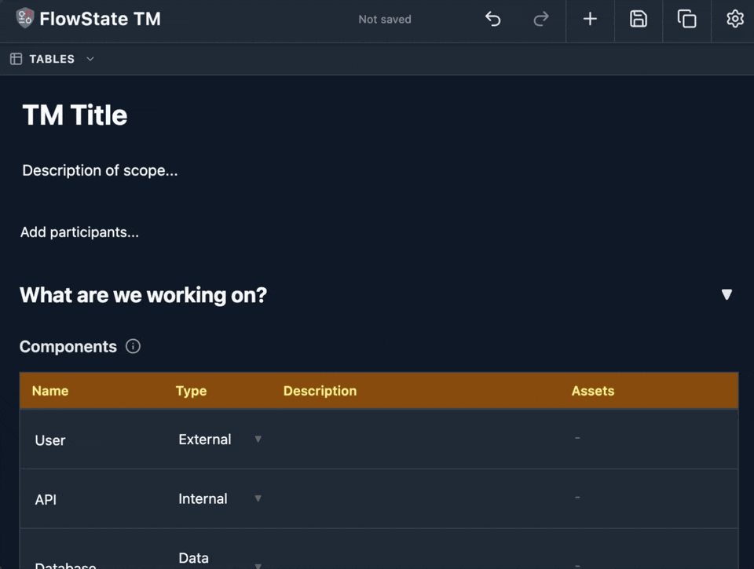
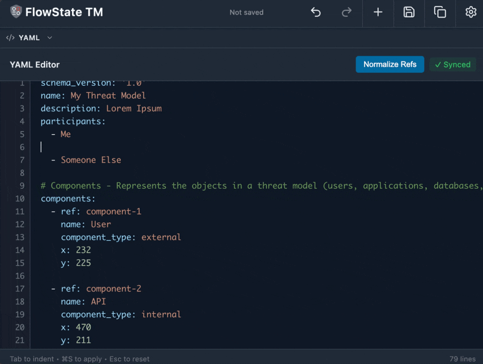

# Exploring the Interface

FlowState TM gives you three synchronized views of your threat model — a visual **Canvas**, structured **Tables**, and raw **YAML**. Each view is designed for a different way of working, and changes in one are instantly reflected in the others.

## Canvas

The canvas is where you build and visualize your data flow diagram. Drag components onto the canvas, connect them with data flows, and organize them within trust boundaries.

**Key actions:**
- **Add components** — Select a type from the toolbar and click on the canvas
- **Connect components** — Use the data flow tool to draw connections between nodes
- **Create trust boundaries** — Group related components inside boundary boxes
- **Pan & zoom** — Scroll to zoom, click and drag the background to pan

## Tables

The tables view presents every entity in your threat model as structured, editable rows. This is the most efficient way to review completeness, bulk-edit properties, and document threats and mitigations.

**Key actions:**
- **Inline editing** — Click any cell to edit it directly
- **Add rows** — Use the add button to create new entries
- **Sort & review** — Quickly scan for missing fields or incomplete items
- **Reorder** — Drag rows to reorder them

## YAML

The YAML view shows the raw source of your threat model. It is ideal for precise edits, copy-pasting between models, and version-control workflows where you want to see exactly what changed.

**Key actions:**
- **Direct editing** — Modify any field in the YAML structure
- **Syntax highlighting** — Errors and structure are highlighted for readability
- **Copy & paste** — Move sections between threat models easily
- **Full control** — Access every property, including those not exposed in the other views
